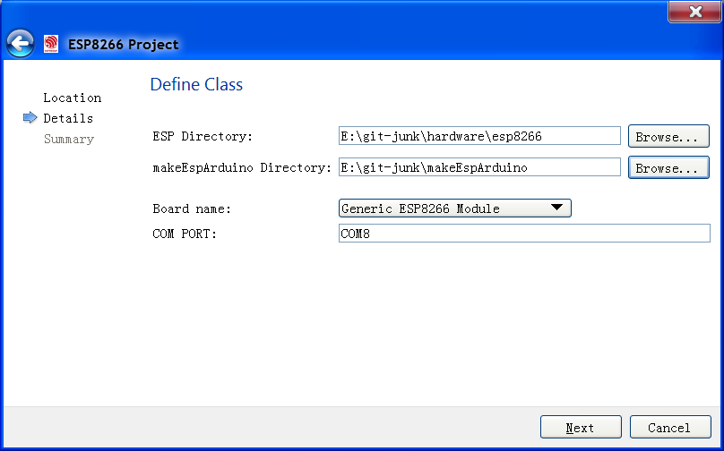
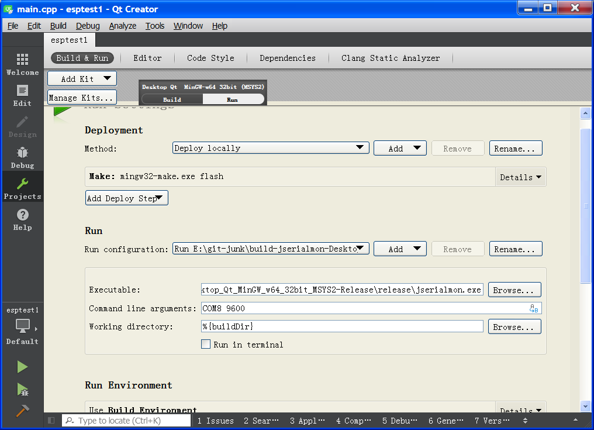

# qt_esp8266_wizard
A wizard for intergrating embeded ESP8266 modules into QtCreator using Arduino style setup loop thing.

### June 2019 note

N.B: I tried it out after a long time and download the new repos it didn't work for me anymore. So it looks like it's currently broken. I would like to fix it up but this time create a qt kit like I did with JADE. This would be a much cleaner solution. Anyway please not that this repo might not work.

## Requirements

Probably lots.

You will need at least...

* [Qtcreator](https://en.wikipedia.org/wiki/Qt_Creator)
* [makeEspArduino](https://github.com/plerup/makeEspArduino)
* [esp8266/Arduino](https://github.com/esp8266/Arduino)
* [Perl](https://en.wikipedia.org/wiki/Perl)
* others??

My system is a Windows 7 computer. I use [MSYS2](http://www.msys2.org/) and the included package manager pacman to install everything.

## Folders

The esp8266 folder goes into your QTcreator's template wizard directory. For me this went in `E:\msys64\mingw64\share\qtcreator\templates\wizards`

The jserialmon folder is a Qt CLI project that you can use to see the output from the esp8266. This I just built with Qtcreator in the usual manor.

## Screenshots

The wizard is minimal but does all I need it to do at the moment. You just click `File`, `New File or Project`, then `Other Project` and `ESP8266 Project` to start the wizard.

Once the wizard has done it's thing you can use Qtcreator for your ESP8266 project. Qtcreator has the best autocompleation of any IDE so I highly recommend it.

I'm always making mistakes and forgetting things so being able to press ctrl-space to find something it somthing I can't do without anymore. Qt really has spoiled me.

To get the run button working requires adding a make step in the run section of project tab, in my case `mingw32-make.exe flash`. Then for the executable I put in `jserialmon.exe` with command line arguments of `COM8 9600`. Now if I press run the program is compiled, flashed and a serial monitor is started. If I press build it only compiles.

